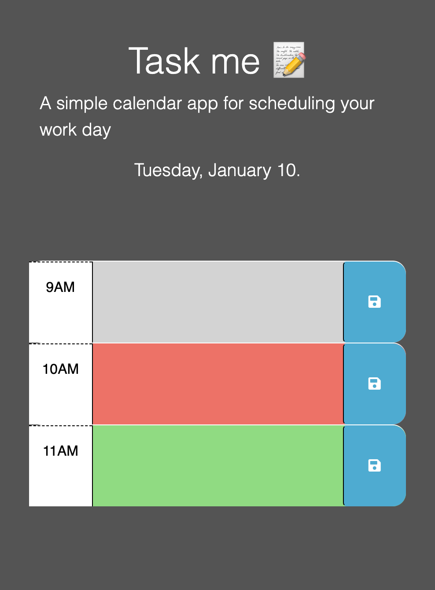

# Task me 📝

## Challenge 5

This challenge is to make a simple work day organizer and you can add an event in the blocks and load the page and the events will follow there.
And I used this pages to undestood better some things to can deploy my Challenge 5.
- BootCamp TDM-VIRT-FSF-PT-10-2022-U-LOLC (Server-Side-APIs)
- https://www.anerbarrena.com/jquery-ready-5103/
- https://www.youtube.com/watch?v=vzGzys3enCE
- https://api.jquery.com/removeclass/
- https://www.tutorialsteacher.com/javascript/this-keyword-in-javascript 
- Comments from the last Challenge (4) 🥳
## User Story

- AS AN employee with a busy schedule
- I WANT to add important events to a daily planner
- SO THAT I can manage my time effectively

## Acceptance Criteria

- GIVEN I am using a daily planner to create a schedule
- WHEN I open the planner
- THEN the current day is displayed at the top of the calendar
- WHEN I scroll down
- THEN I am presented with time blocks for standard business hours
- WHEN I view the time blocks for that day
- THEN each time block is color-coded to indicate whether it is in the past, present, or future
- WHEN I click into a time block
- THEN I can enter an event
- WHEN I click the save button for that time block
- THEN the text for that event is saved in local storage
- WHEN I refresh the page
- THEN the saved events persist

- [GitHub/ Jeacqueline's Repository](https://github.com/Jeacqueline/Task-me)

- [GitHub/ Jeacqueline/ Deployed Task-me]( https://jeacqueline.github.io/Task-me/ )